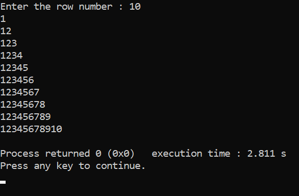
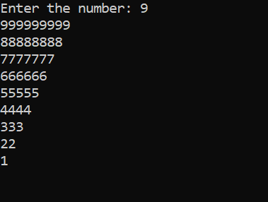
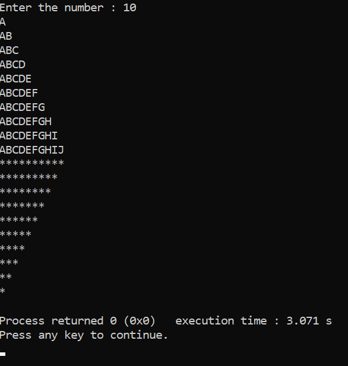

<!--C Programme-->
_-write a programme that print pattern._

Pattern
---
### Right half ___Pyramid___ 

<p> set number that will print right half pyramid pattern </p>

```c
#include<stdio.h>
int main()
{
    int row,col,num;
    printf("Enter the row number : ");
    scanf("%d",&num);

    for(row=1; row<=num; row++)
    {
        for(col=1; col<=row; col++)
        {
            printf("%d",col);
        }
        printf("\n");
    }
    getchar();
}
```  

</br>

<ol>
<li>1</li>
<li>2</li>
<li>3</li>
<li>4</li>
</ol>

### Inverted _right_ half __Pyramid__

```c
#include<stdio.h>
int main()
{
    int num,row,col;
    printf("Enter the number: ");
    scanf("%d",&num);

    for(row=num; row>=1; row--)
    {
        for(col=1; col<=row; col++)
        {
            printf("%d",row);
        }
        printf("\n");
    }
    getch();
}
```  

</br>

## Right half & inverted Right half  

```c
#include<stdio.h>
int main()
{
    int num,row,col,ro,co;
    printf("Enter the number : ");
    scanf("%d",&num);

    for(row=1; row<=num; row++)
    {
        for(col=1; col<=row; col++)
        {
            printf("%c",col+64);
        }
        printf("\n");
    }
    for(ro=num; ro>=1; ro--)
    {
        for(co=1; co<=ro; co++)
        {
            printf("*");
        }
        printf("\n");
    }
    return 0;
}
```


Thank you.